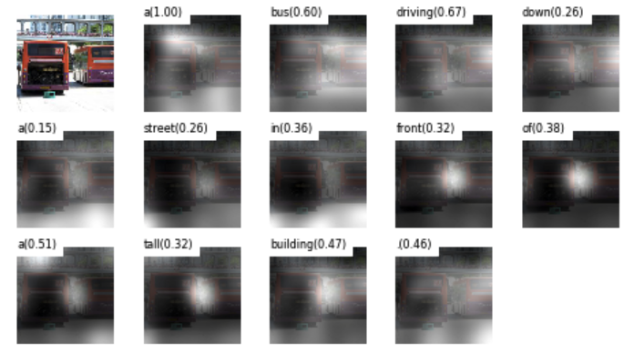

# Image Caption Generation System Based on Visual Attention Mechanism

## Mainly References

Xu K, Ba J, Kiros R, et al. Show, Attend and Tell: Neural Image Caption Generation with Visual Attention[J]. Computer Science, 2016:2048-2057

Luong M T, Pham H, Manning C D. Effective approaches to attention-based neural machine translation[J]. arXiv preprint arXiv:1508.04025, 2015.

<br/>


## Datasets: 

MSCOSO dataset is a large-scale object detection, key-point detection, and image captioning dataset.

## Technical details:

The project is basically divided into three parts: pre-processing, encoder and decoder. We use this for our project.We will use the encoder-decoder framework to realize this system. For the encoder part, we use the VGG19 model which is a CNN with 19 layers deep that have been pre-trained on the ImageNet dataset. The network takes a  RGB image as the input. For the decoder part, we add soft attention to the LSTM model. 

## Implementation process

First, we need to install MSCOCO dataset,VGGNet19 model, Python and TensorFlow. ALso before we extract the features of the object, we need to preprocess the image in the database.


```bash
$ git clone https://github.com/CynthiaXing/Image-Caption-Generation-System.git
$ git clone https://github.com/tylin/coco-caption.git
```

Second, the VGG19 model requires the input image size to be 224×224. First process is to resize the image to 224×224 and then to extract the shallow visual features of the image. In this project, all the images in the database are preprocessed for cropping images and stored locally to reduce the memory usage of the computer during the shallow features extraction process. We can use the following code to achieve this resize process. Also, preprocess is necessary for MSCOCO dataset to process image annotation.


```bash
$ python resize.py
$ python prepro.py
```
<br>

Third, train the model of project: using the pre-trained feature extractor to extract the object features in the image, and then send them to the LSTM decoder.

```bash
$ python train.py
```
<br>


## Results Analysis

After trainning the model, wecan use the following code to generate the caption of images and evaluation indicators. More details can be found in 'Evaluation of model_DL project.ipynb'.


```bash
$ model = CaptionGenerator(word_to_idx, dim_feature=[196, 512], dim_embed=512,
                                   dim_hidden=1024, n_time_step=16, prev2out=True, 
                                             ctx2out=True, alpha_c=1.0, selector=True, dropout=True)
$ solver = CaptioningSolver(model, data, data, n_epochs=15, batch_size=128, update_rule='adam',
                                      learning_rate=0.0025, print_every=2000, save_every=1, image_path='./image/val2014_resized',
                                pretrained_model=None, model_path='./model/lstm', test_model='./model/lstm/model-20',
                                 print_bleu=False, log_path='./log/')
$ solver.test(test, split='test')
$ evaluate(data_path='./data', split='test')                               
```
<br>


#### Test data

##### (1) Generated caption: A bus driving down a street in front of a tall building.


##### (2) Generated caption: Two sheep standing in a grassy field next to a tree.


##### (3) Generated caption: A white bathroom with a white toilet and sink.


##### (4) Generated caption: A man swinging a baseball bat on a field.


#### Evaluation indicators results of  METEOR and BLEU


